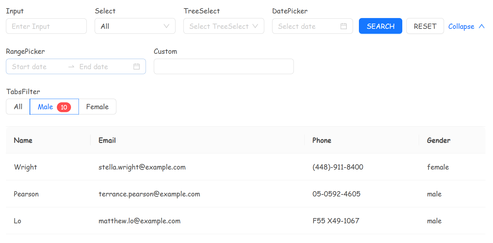

# Generate TableWithFilters

> Based on the [Ant Design 5.0](https://ant.design/index-cn) component library，this generates a Table component directly from a JSON array with filtering capabilities.
>
> Filtering conditions, data requests, and data presentation are realized through [useAntdTable - ahooks 3.0](https://ahooks.js.org/zh-CN/hooks/use-antd-table).

## Code Example

```tsx
const filters: any = [
  { name: "Hidden", type: "Hidden", initialValue: "121212" },
  { name: "Input", label: "Input", type: "Input" },
  {
    name: "Select",
    label: "Select",
    type: "Select",
    initialValue: "all",
    options: [
      { value: "all", label: "All" },
      { value: "male", label: "Male" },
      { value: "female", label: "Female" },
      { value: "other", label: "Other" },
    ],
  },
  {
    name: "TreeSelect",
    label: "TreeSelect",
    type: "TreeSelect",
    treeData: [
      {
        title: "Light",
        value: "light",
        children: [{ title: "Bamboo", value: "bamboo" }],
      },
    ],
  },
  {
    name: "DatePicker",
    label: "DatePicker",
    type: "DatePicker",
    format: "YYYY-MM-DD",
  },
  {
    name: "RangePicker",
    label: "RangePicker",
    type: "RangePicker",
    format: "YYYY-MM-DD",
  },
  {
    name: "Custom",
    label: "Custom",
    type: "Custom",
    span: 10,
    element: (props: any) => <Input onChange={props.onChange} value={props.value} />,
  },
  {
    name: "Radio",
    label: "RadioFilter",
    type: "Radio",
    initialValue: "male",
    options: [
      {
        value: "all",
        label: "All",
      },
      {
        value: "male",
        label: <>Male<Badge className="ml-2" count={10} /></>,
      },
      {
        value: "female",
        label: "Female",
      },
    ]
  }
];

const TablePage = () => {
    return (<Table
    // ...
    filters={filters}
    rowKey={(record: any) => record.email}
    //...
    } />)
}
```
## Effect



## Currently Supported FilterItem

> The span attribute can control the width of the form items, specifically referencing Ant Design's [Grid](https://ant.design/components/grid-cn/#components-grid-demo-basic) component.
>
> Default span for each Filter component:
>
> ```ts
> export const Span: Record<FILTER_ITEM_TYPE, number> = {
>   	Hidden: 0,
>   	Input: 6,
>   	Select: 6,
>   	TreeSelect: 6,
>   	DatePicker: 6,
>   	RangePicker: 10,
>   	Custom: 6,
>   	Radio: 24
> }
> ```


### Basic Components


1. InputFilter
2. SelectFilter
3. DateFilter
4. RangeFilter
5. TreeFilter
6. RadioFilter

> These components are simple extensions of the regular [Form]([Form - Ant Design](https://ant.design/components/form)).Item.


### Special Components


1. HiddenFilter

   > A Hidden FilterItem directly inserts the corresponding name parameter and value into the filtering conditions, which are then included in the API request parameters. In most cases, you may not need to use this component. Modifying the request method directly might be a better choice for you.

2. CustomFilter

   > A Custom FilterItem allows for custom filter components.
   >
   > Refer to [customized-form-controls](https://ant.design/components/form-cn#components-form-demo-customized-form-controls) for implementation.
