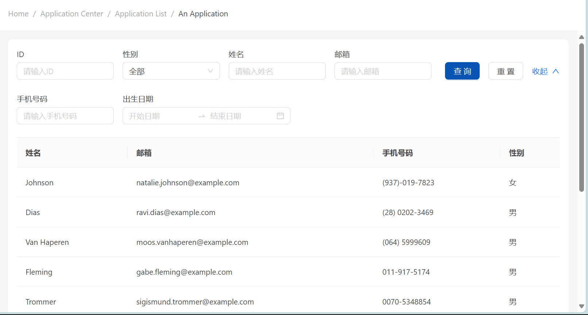
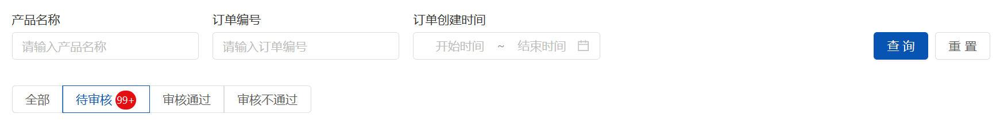

# TableWithFilters

> 基于 [Ant Design 5.0](https://ant.design/index-cn) 组件库，使用 json 数组直接生成带有过滤条件的 Table 组件。
>
> 过滤条件、数据请求和数据展示通过 [useAntdTable - ahooks 3.0](https://ahooks.js.org/zh-CN/hooks/use-antd-table) 实现。

## 代码示例

```tsx
const filters = [
  { name: "id", label: "ID", type: "Input" },
  {
    name: "gender", label: "性别", type: "Select", initialValue: "",
    options: [
      { value: "", label: "全部" },
      { value: "male", label: "男" },
      { value: "female", label: "女" },
    ]
  },
  { name: "name", label: "姓名", type: "Input" },
  { name: "email", label: "邮箱", type: "Input" },
  { name: "phone", label: "手机号码", type: "Input" },
  { name: "birthdate", label: "出生日期", type: "RangePicker", format: "YYYY-MM-DD" },
]

const TablePage = () => {
    return (<Table
    // ...
    filters={filters}
    rowKey={(record: any) => record.email}
    //...
    } />)
}
```



## 当前支持的 FilterItem

1. InputFilter
2. SelectFilter
3. DateFilter
4. RangeFilter
5. TreeFilter

## 待扩展

- [x] HiddenFilter

  > 不会在页面上显示的过滤条件。

- [x] CustomFilter

  > 自定义过滤控件。参考 Ant Design 的自定义表单控件实现
  >
  > - 提供受控属性 `value` 或其它与 [`valuePropName`](https://ant.design/components/form-cn#formitem) 的值同名的属性。
  > - 提供 `onChange` 事件或 [`trigger`](https://ant.design/components/form-cn#formitem) 的值同名的事件。
  > - 转发 ref 或者传递 id 属性到 dom 以支持 `scrollToField` 方法。

- [x] TabsFilter

  > Tabs 组实现过滤条件的选择，参考现有产品：
  >
  > 
  >
  > 预期实现 Badge 徽标
